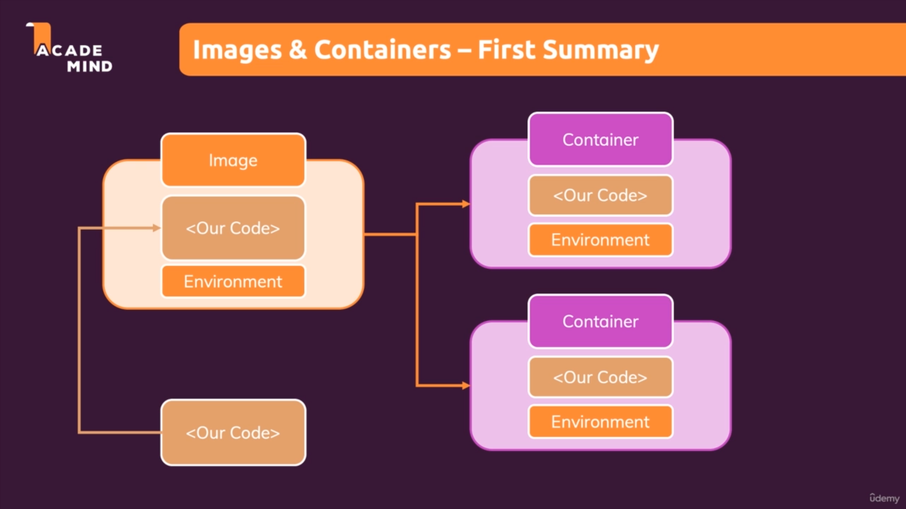
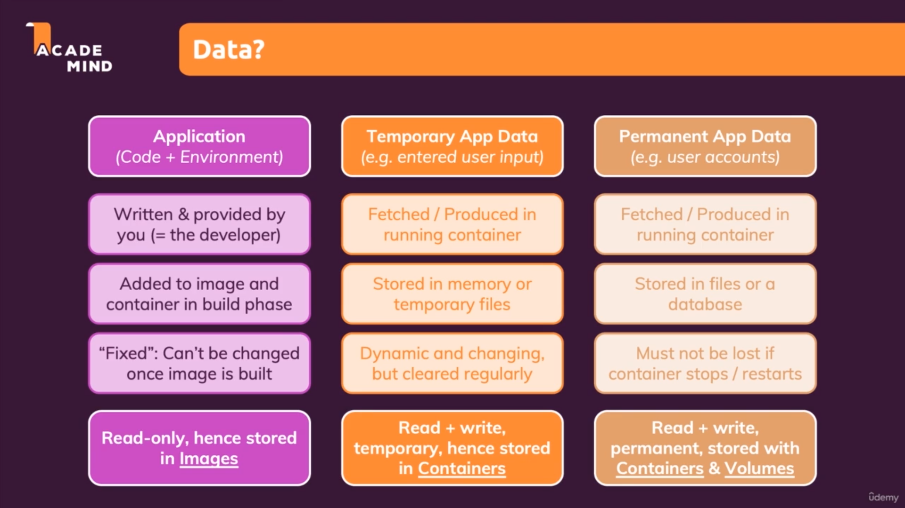
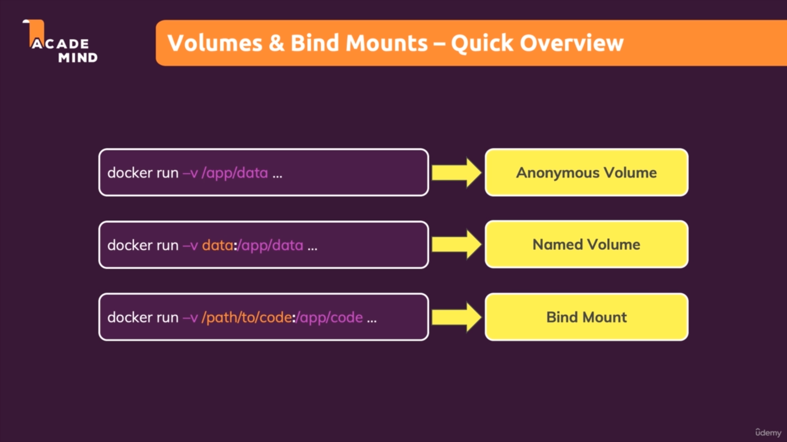
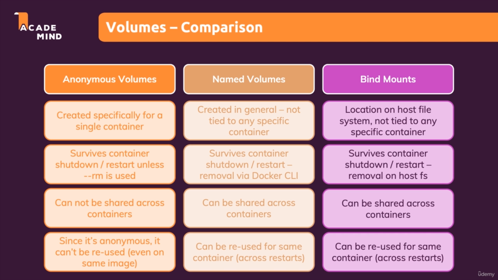
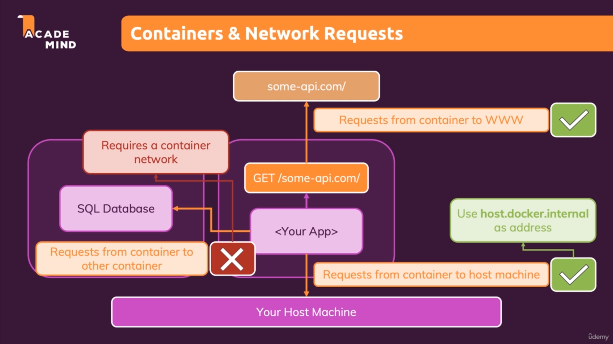
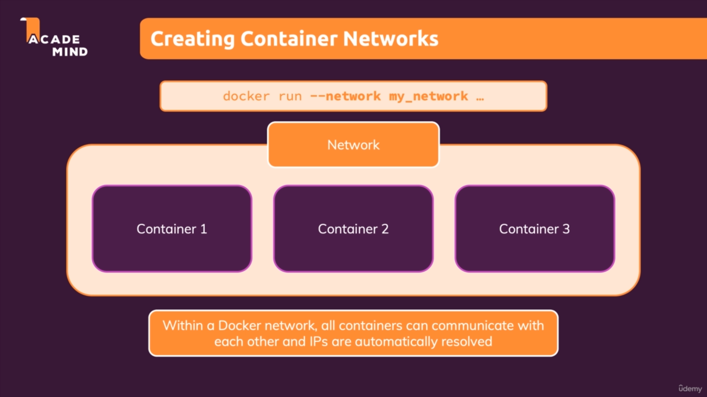

# Docker notes

> [!CAUTION]
> This note is from **[Maximilian Schwarzmüller - Docker & Kubernetes](https://www.udemy.com/course/docker-kubernetes-the-practical-guide/)** course

## Images vs Containers

- **Container**: The running unit of software
- **Image**: The templates/blueprints for containers, Images contains code and runtime tools and then used to create multiple **containers**. 

The `image` is the shareable package with all the setup instructions and all the codes, and `container` will be the concrete running instance off such an image.

**We run containers, which are based on images**



## RUN vs CMD in Dockerfile

- **RUN**: `RUN` is a image command, it means that it will executed when we are build the image, and it will not executed when we want to create a container base on that particular image
- **CMD**: `CMD` is a Runtime command, and it will executed at creating a new container, or running the container.

> [!NOTE]
> The syntax of writting `RUN` command and `CMD` command has differences
> The commands for `CMD` should be in a brackets `[]` and isolated from them by double qoutes.

**Example:**

```dockerfile
FROM node:latest

WORKDIR /app

COPY . .

EXPOSE 3000

RUN npm install

CMD ["node", "server.js"]
```

---

### Docker image has layered structure

- [Source](https://www.linkedin.com/pulse/understanding-docker-layers-efficient-image-building-majid-sheikh/)

At its core, a Docker image is composed of a series of read-only layers stacked on top of each other. Each layer represents a set of file system changes, and every Dockerfile instruction adds a new layer to the image. These layers are cached by Docker, enabling quicker image builds and efficient use of resources.

#### How does docker know about changes in file?

Imagine that you copied project source code to image, but in development process you made a few changes and you want to apply them in your container/containers as well, But first of all if you don't bind the source code to the container, you have to re-build the image and then create containers from that new image.

But docker used layered structure for better performance in creating images, and it will notice about changes in your source code and then from the `COPY` instruction till the end, it won't use cached layers and it will build new ones. 

Docker will notice changes in source code by this:

##### How Docker Detects Changes

Docker uses the content of the files and the Dockerfile instructions to decide whether to use the cache or rebuild a layer.
For the `COPY` or `ADD` instructions, Docker checks the files being copied (e.g., your source code) to see if they have changed since the last build.

##### Key Points for `COPY` or `ADD`:

- Docker calculates a **checksum (hash)** for the files being copied.
- If the checksum of the files matches the checksum from the previous build, Docker uses the cached layer.
- If the checksum differs (e.g., because you modified your source code), Docker invalidates the cache and rebuilds the layer.

##### What is a Checksum?

A **checksum** is a value calculated from a set of data (e.g., a file or a group of files) using a mathematical algorithm. It acts like a `"fingerprint"` for the data. If the data changes, even slightly, the checksum will also change. This makes checksums useful for detecting changes in files.

In Docker, checksums are used to determine whether files (like your source code) have changed since the last build. If the checksum of a file changes, Docker knows it needs to rebuild the corresponding layer.

##### How is a Checksum Calculated?

Checksums are calculated using hashing algorithms. These algorithms take the input data (e.g., the contents of a file) and produce a fixed-length string of characters (the checksum). Common hashing algorithms include:

- MD5 (Message Digest Algorithm 5)
- SHA-1 (Secure Hash Algorithm 1)
- SHA-256 (part of the SHA-2 family)

##### Does Hashing Take Time?

`Yes`, hashing takes time, but **it’s usually very fast**. The time it takes depends on:

**The Size of the Data**: Larger files take longer to hash because the algorithm has to process more data.

**The Hashing Algorithm:** Some algorithms are faster than others. For example, `MD5` is faster than `SHA-256`, but `SHA-256` is **more secure**.

**Hardware Performance:** Faster CPUs and SSDs can speed up the hashing process.

##### In the context of Docker:

Docker only needs to hash the files that are being copied (e.g., your source code), not the entire image.
For most projects, the hashing process is negligible compared to the time it takes to build the image (e.g., installing dependencies or compiling code).

##### Best Practices

1. Place instructions that change frequently (e.g., COPY . /app) toward the end of the Dockerfile to maximize cache usage for earlier layers (e.g., installing dependencies).

###### Example of a regular Dockerfile

```dockerfile
FROM node:latest

WORKDIR /app

COPY . .

EXPOSE 3000

RUN npm install

CMD ["node", "server.js"]
```

###### Example of an optimized Dockerfile

```dockerfile
FROM node:latest

WORKDIR /app

COPY package.json /app

RUN npm install

COPY . .

EXPOSE 3000

CMD ["node", "server.js"]
```

2. Use `.dockerignore` to exclude unnecessary files from being copied, which can help avoid unnecessary cache invalidations.

---

> [!IMPORTANT]
> For every docker command, you can call them using `--help` to see the list of options that command will take
> ```sh
> docker ps --help
> ```

### Understand Docker `attached` and `detached` mode

`Attached` mode is a mode that is default when you run a new container from an image using `docker run` command. In `Attached` mode you'll see the logs of the container because it blocks your terminal with running session.

`Detached` mode on the other hand is running in the background. It means that by running in `detached` mode your session doesn't block your active and current terminal and it will run container in background. When you start an existing container using `docker start` command, by default it will run in `detached` mode.

> [!NOTE]
> You can also run a new container from an image in `detach` mode by adding extra `-d` flag into `docker run` command:
> ```sh
> docker run -d my_back_end_image:1.0.0
> ```


### Docker commands

#### docker start <container_name> | <container_id>

This command will **start** `exited` and `existed` container.

##### Flags

- `-a`: Start container in `attach` mode,  **Attach STDOUT/STDERR and forward signals**
- `-i`: Attach container's STDIN

> [!IMPORTANT]
> If you have a container that you want to start it and have interact with it using terminal, you can start container by `docker start -ai` flag.

For example, Imagine that you have this code:

```python
name = input("Enter your name:")
print(f"Hello {name}")
```

Imagine that you have built your python image, and then you want to run it, You can run it using:

```sh
docker run -it hello-python-code:1.0.0
```

After done, you can re start that container by:

```sh
docker start -ai hello-python-code:1.0.0
```

#### docker attach <container_name> | <container_id>

This command will `attach` terminal to running container, by doing this you can see the container logs in your active terminal, but your terminal will block by running session.

#### docker logs <container_name> | <container_id>

Fetch the logs of a container.

##### Flags

- `-f`: Follow the container logs, and attach the terminal to the logs outputted by container

#### docker run <container_name> | <container_id>

Create and run a new container from an image

##### Flags

- `-d` | `--detach`: Run container in background and print container ID
- `-i` | `--interactive` : Keep STDIN open even it not attached
- `-t` | `--tty`: Allocate a pseudo-TTY `Means that it will allocate a pseudo terminal to the container for us`
- `-it`: You can simply run a container in attach mode and interact with container for example `STDIN`
- `-p` | `--publish`: Publish a container's port(s) to the host
- `--restart`: Restart policy to apply when a container exits (default "no"), Example: `docker run --restart=always busybox:latest`
- `--rm`: Automatically remove the container and its associated anonymous volumes when it exits
- `--name`: Assign a name to the container
 
#### docker rm  <container_name> | <container_id>

Remove one or more containers. You can pass container names or ids separated by space, to remove them all

##### Flags

- `-f` | `--force`: Force the removal of a running container

> [!NOTE]
> For removing all stopped container you can run `docker container prune`
> It will `Remove all stopped containers`

#### docker container prune

Remove all stopped containers

##### Flags

- `-f` | `--force`: Do not prompt for confirmation

#### docker ps 

List containers

**Aliases:**

```
docker container ls, docker container list, docker container ps, docker ps
```

##### Flags 
- `-a` | `--all`: Show all containers (default shows just running)
- `-q` | `--quiet`: Only display container IDs

> [!NOTE]
> A trick for running all stopped containers is to run:
> ```sh
> docker rm $(docker ps -aq)
> ```
> And for remove all containers, including running ones:
> ```sh
> docker rm -f $(docker ps -aq)
> ```


#### docker rmi <image_name> | <image_id>

Remove one or more images

**Aliases:**

```
docker image rm, docker image remove, docker rmi
```

##### Flags 
- `-f` | `--force`: Force removal of the image

> [!CAUTION]
> When running `docker rmi`, it only remove images that are not using by any container, even that container is `stopped`. For removing an image even if is attached to a existing container, you must run `docker rmi -f`, **using force flag!**.

#### docker image prune

Remove unused images

##### Flags 
- `-a` | `--all`: Remove all unused images, not just dangling ones
- `-f` | `--force`: Do not prompt for confirmation

---

### What are dangling images in docker?

Dangling images in Docker are unused or unreferenced image layers that are no longer associated with any tagged image. They occur when you build, pull, or update Docker images, and the old layers are left behind without being cleaned up. These images are not directly useful and can take up disk space.

### How Dangling Images Are Created:
1. **Rebuilding an Image**: When you rebuild a Docker image with the same tag, the old image layers become untagged and are left as dangling images.
2. **Pulling Updated Images**: If you pull a newer version of an image with the same tag, the previous version becomes dangling.
3. **Intermediate Layers**: During the build process, intermediate layers may be created and left behind if they are not part of the final image.

### Identifying Dangling Images:
You can list dangling images using the following Docker command:
```bash
docker images -f "dangling=true"
```
This will show all images that are untagged and not associated with any container.

### Cleaning Up Dangling Images:
To remove dangling images and free up disk space, you can use:
```bash
docker image prune
```

This command removes all dangling images. If you want to remove unused images (not just dangling ones), you can use:

```bash
docker image prune -a
```

Be cautious with `-a`, as it removes all images not associated with a container, including potentially useful ones.

### Preventing Dangling Images:
- Use unique tags for different versions of your images.
- Regularly clean up unused images using `docker image prune`.
- Use multi-stage builds to minimize intermediate layers.

**By managing dangling images, you can keep your Docker environment clean and efficient.**

---

#### docker image inspect <image_name> | <image_id>

Display detailed information on one or more images
By running this command, you can see a detailed information about that image including `layers`, `entrypoint`, `exposes ports`, ...

#### docker cp 

Copy files/folders between a container and the local filesystem.
By using this command, you can copy files/folders from your machine to a container or copy something from container to your local filesystem.

**Aliases:**

```
docker container cp, docker cp
```

##### Example 1: copy from local filesystem to container

This command will copy everything under the `src/` directory due to `.`, and paste it in my container with name: `my_container_name` and in the `/app` directory.

```sh
docker cp src/. my_container_name:/app
```

##### Example 1: copy from container to local filesystem

This command will copy single file `error_logs.log` from my container, to my `src` directory which is located in my local machine.

```sh
docker cp my_container_name:/app/error_logs.log src/
```

### Sharing Docker Images

> [!TIP]
> For sharing dockerized application, we don't share containers at all, but instead, we share images
> But for sharing images there is 2 way:
> 1. Share raw Dockerfile
> 2. Share built image

1. Share raw Dockerfile:

By sharing a raw Dockerfile, we also should contain our dependencies for building image to share with Dockerfile, like source code.

2. Share built image:

For sharing a built image, we just need to access the built image and no dependencies are required, because they are already existed in built image.
To share a built image there is 2 way:

- Sharing with DockerHub (Public registery)
- Sharing with Private registeries

#### docker push <image_name>

Upload an image to a registry

#### docker pull <image_name>

Download an image from a registry

> [!WARNING]
> If you want to push or pull from a private registery, you have to include the private registery url before the image name
> By default, if you don't modify tag for a image to pull, it download the `latest` image tag **by default**.

---

## Data in Docker containers



> [!IMPORTANT]
> As it shown in image above, there are 3 main types of data in docker containers, but for the last and third one, we use volumes to permanently keep the data that is 
> important for us, like users data.

## Docker volumes

**Volumes** are folders on your host machine that are `mounted` into **container**.

Volumes persist if a container shutdown. If a container (re-)starts and mounts a volume, any data inside of that volume is available in the container.

> [!IMPORTANT]
> A container can **read and write** data from/to a volume.

---

- **[Source](https://docs.docker.com/engine/storage/volumes/)**

Volumes are persistent data stores for containers, created and managed by Docker.
You can create a volume explicitly using the `docker volume create` command, or Docker can create a volume during container or service creation.

When you create a volume, it's stored within a directory on the `Docker host`. 
When you mount the volume into a container, this directory is what's mounted into the container. 
This is similar to the way that **bind mounts** work, except that volumes are managed by **Docker** and **are isolated from the core functionality of the host machine.**

> [!WARNING]
> **Volumes** and **Bind mount** are different, keep this in mind

## Bind mounts

- [Source](https://docs.docker.com/engine/storage/bind-mounts/)

When you use a `bind mount`, **a file or directory on the host machine is mounted from the host into a container**.
By contrast, when you use a volume, a new directory is created within Docker's storage directory on the host machine,
and **Docker** manages that directory's contents.

### When to use volumes

`Volumes` are the preferred mechanism for persisting data generated by and used by Docker containers. 
While bind mounts are dependent on the directory structure and OS of the host machine, volumes are completely managed by **Docker**.
Volumes are a good choice for the following use cases:

- Volumes are easier to back up or migrate than bind mounts.
- You can manage volumes using Docker CLI commands or the Docker API.
- Volumes work on both Linux and Windows containers.
- Volumes can be more safely shared among multiple containers.
- New volumes can have their content pre-populated by a container or build.
- When your application requires high-performance I/O.

> [!CAUTION]
> Volumes are not a good choice **if you need to access the files from the host**, as the volume is completely managed by Docker.
> Use `bind mounts` if you need to access files or directories from both containers and the host.

## When to use Bind mounts

- Sharing source code or build artifacts between a development environment on the Docker host and a container.
- When you want to create or generate files in a container and persist the files onto the host's filesystem.
- Sharing configuration files from the host machine to containers. This is how Docker provides DNS resolution to containers by default, by mounting /etc/resolv.conf from the host machine into each container.

### Named and anonymous volumes

A volume may be named or anonymous. Anonymous volumes are given a random name that's guaranteed to be unique within a given Docker host. A volume may be named or anonymous.
Anonymous volumes are given a random name that's guaranteed to be unique within a given Docker host. 
Just like named volumes, anonymous volumes persist even if you remove the container that uses them, except if you use the `--rm` flag when **creating the container**,
in which case the anonymous volume associated with the container is destroyed.

### docker mount volume 

```sh
docker run --mount type=volume,src=<volume-name>,dst=<mount-path>
docker run -v <volume-name>:<mount-path>
```

### How to make a anonymous volume in Dockerfile

```dockerfile
VOLUME ["/app"]
```

Imagine that you have a `NodeJS` application and you want to bind it to the root path in the container, but by doing this, the node_modules and 
every thing that is made by image, will be disappear, cause of `bind mount`.
For fixing this issue:

```Dockerfile
FROM node:22

WORKDIR /app

COPY package.json /app

RUN npm install 

VOLUME ["/app/node_modules"]

CMD ["node", "server.js"]
```

And then, you can run the built image by:

```sh
docker run -v /path/to/your/project:/app your_built_image:latest
```

> [!CAUTION]
> When you use `bind mounts` keep in mind that everything in the mounted directory in container, will replace by data from host machine, not overriden but replace.
> But in `volumes`, if you mount a directory containing files and data in the container, they will be copy into the mounted volume. 
> Even though, you can mount a volume with `no-copy` extra falg for avoid this copy. see this [doc](https://docs.docker.com/engine/storage/volumes/#options-for---volume)

> [!TIP]
> Anonymous volumes as I mentioned are useful when you're bind a directory, to a path in container, **which already has data**, and you want to `keep` that existing data in the container.

> [!NOTE]
> Anonymous volumes will remain even after container shutdown, but if you run the container using `--rm` flag, they will removed by stopping container, just like as container removes.

### Docker volume commands

#### docker volume prune

Remove unused local volumes

```sh
docker volume prune
```

##### Flags

- `-a` | `--all`: Remove all unused volumes, not just anonymous ones
- `-f` | `--force`: Do not prompt for confirmation

#### docker volume rm

Remove one or more volumes. You cannot remove a volume that is in use by a container


##### Flags

- `-f` | `--force`: Force the removal of one or more volumes

#### docker volume inspect

Display detailed information on one or more volumes

```sh
docker volume inspect
```

#### docker volume ls

List volumes

```sh
docker volume ls
```

#### docker volume create

Create a volume

```sh
docker volume create <volume-name>
```




### Docker ENV vs Docker ARGS

| ENV | ARG |
| --- | --- |
| Available inside a `Dockerfile`, Not accessible in CMD or any application code | Available inside of a `Dockerfile` and in Application code |
| Set on image build (docker build) via `--build-arg` | Set via `ENV` in Dockerfile or via `--env` or `-e` on `docker run` |

Example of usage:

```dockerfile
ENV PORT 8000

EXPOSE $PORT
```

We can also change it for running a container by:

```sh
docker run -e PORT=8080 your_image
```


```sh
docker run --env PORT=8080 your_image
```

Or, set it in a file and pass the file to the container by `--env-file` tag:

- **.env:**

```env
PORT=8080
```

- **Running container:**

```sh
docker run --env-file ./.env your_image
```

But for docker Arguments, as I mentioned arguments are build time variables, and they are not allowed to modify in runtime.

For example, we can set a default port for an image:

```dockerfile
# You can set a optional default value when define a argument!

ARG DEFAULT_PORT 80

EXPOSE $DEFAULT_PORT
```

And also you can change the `DEFAULT_PORT` when you're build the image:

```sh
docker build --build-arg DEFAULT_PORT=8000
```

> [!TIP]
> You can combine `ARG` and `ENV` to be used together:

```dockerfile
ARG DEFAULT_PORT 8000

ENV PORT $DEFAULT_PORT

EXPOSE $PORT
```

And now, you can modify your port that want to expose, in `runtime` and `build time`, both!

---

## Docker Networks

### Types of networks in docker

Imagine that you have a docker container, each of these senarios are possible for your container to happen:

1. **Connect to a world API:** your application might want to connect to internet, for example for fetch something from an API
2. **Connect to your host machine**: Your app might want to connect to something running on your host machine, for example connect to a MongoDB that is running in your machine.
3. **Connect to another container**: Your application might want to connect to another docker container, for example a `Redis DB` container.

> [!NOTE]
> In the case `Connect to a world API`, containers don't need any special setup, and they works fine. We just need to implement some setup and configs for other 2 ways of communications.

---

- **Connect to host machine**

For connecting to the host machine, docker gives us a special URL for simplify the communication building.
Imagine that From container I want to get connect to a `Redis` running in my machine.
The `Redis` url in previous was:

```sh
redis://localhost:6379
```

But now, for running from container I just need to replace the `localhost` with `host.docker.internal`. So the new URL would be:

```sh
redis://host.docker.internal:6379
```

> [!NOTE]
> By setting `host.docker.internal`, Docker will replace the host IP address with this special URL, so the communication will working

---

- **Connect to another container**

For communication with another container, there are 2 ways:

1. Using container IP address

You can get inspect of your container, then Find the IP Address of container and put it in your container that want to create connection.

```sh
docker container inspect 
```

It will give you something like this:

```sh
[
    {
        "Id": "f4bd4cc9f44720fba7f258afdcfd5a86d4c4cc3a10eb938cb6b9004844128d73",
        "Created": "2025-03-24T16:00:11.760229737Z",
        "Path": "docker-entrypoint.sh",
        "Args": [
            "redis-server"
        ],
        "State": {
            "Status": "running",
            "Running": true,
            "Paused": false,
            "Restarting": false,
            "OOMKilled": false,
            "Dead": false,
            "Pid": 2656,
            "ExitCode": 0,
            "Error": "",
            "StartedAt": "2025-03-27T12:36:22.514224694Z",
            "FinishedAt": "2025-03-27T09:00:02.899868098Z"
        },
        "Image": "sha256:8d7a968b2bafc1c56e6fe76b0ddc256eeed9b350ee32dcafe3bddea7700fbe38",
        "ResolvConfPath": "/var/lib/docker/containers/f4bd4cc9f44720fba7f258afdcfd5a86d4c4cc3a10eb938cb6b9004844128d73/resolv.conf",
        "HostnamePath": "/var/lib/docker/containers/f4bd4cc9f44720fba7f258afdcfd5a86d4c4cc3a10eb938cb6b9004844128d73/hostname",
        "HostsPath": "/var/lib/docker/containers/f4bd4cc9f44720fba7f258afdcfd5a86d4c4cc3a10eb938cb6b9004844128d73/hosts",
        "LogPath": "/var/lib/docker/containers/f4bd4cc9f44720fba7f258afdcfd5a86d4c4cc3a10eb938cb6b9004844128d73/f4bd4cc9f44720fba7f258afdcfd5a86d4c4cc3a10eb938cb6b9004844128d73-json.log",
        "Name": "/how_much_is_it_crawler_redis",
        "RestartCount": 0,
        "Driver": "overlay2",
        "Platform": "linux",
        "MountLabel": "",
        "ProcessLabel": "",
        "AppArmorProfile": "docker-default",
        "ExecIDs": null,
        "HostConfig": {
            "Binds": null,
            "ContainerIDFile": "",
            "LogConfig": {
                "Type": "json-file",
                "Config": {}
            },
            "NetworkMode": "how-much-is-it-crawler_default",
            "PortBindings": {
                "6379/tcp": [
                    {
                        "HostIp": "",
                        "HostPort": "6380"
                    }
                ]
            },
            "RestartPolicy": {
                "Name": "always",
                "MaximumRetryCount": 0
            },
            "AutoRemove": false,
            "VolumeDriver": "",
            "VolumesFrom": null,
            "ConsoleSize": [
                0,
                0
            ],
            "CapAdd": null,
            "CapDrop": null,
            "CgroupnsMode": "private",
            "Dns": [],
            "DnsOptions": [],
            "DnsSearch": [],
            "ExtraHosts": [],
            "GroupAdd": null,
            "IpcMode": "private",
            "Cgroup": "",
            "Links": null,
            "OomScoreAdj": 0,
            "PidMode": "",
            "Privileged": false,
            "PublishAllPorts": false,
            "ReadonlyRootfs": false,
            "SecurityOpt": null,
            "UTSMode": "",
            "UsernsMode": "",
            "ShmSize": 67108864,
            "Runtime": "runc",
            "Isolation": "",
            "CpuShares": 0,
            "Memory": 0,
            "NanoCpus": 0,
            "CgroupParent": "",
            "BlkioWeight": 0,
            "BlkioWeightDevice": null,
            "BlkioDeviceReadBps": null,
            "BlkioDeviceWriteBps": null,
            "BlkioDeviceReadIOps": null,
            "BlkioDeviceWriteIOps": null,
            "CpuPeriod": 0,
            "CpuQuota": 0,
            "CpuRealtimePeriod": 0,
            "CpuRealtimeRuntime": 0,
            "CpusetCpus": "",
            "CpusetMems": "",
            "Devices": null,
            "DeviceCgroupRules": null,
            "DeviceRequests": null,
            "MemoryReservation": 0,
            "MemorySwap": 0,
            "MemorySwappiness": null,
            "OomKillDisable": null,
            "PidsLimit": null,
            "Ulimits": null,
            "CpuCount": 0,
            "CpuPercent": 0,
            "IOMaximumIOps": 0,
            "IOMaximumBandwidth": 0,
            "MaskedPaths": [
                "/proc/asound",
                "/proc/acpi",
                "/proc/kcore",
                "/proc/keys",
                "/proc/latency_stats",
                "/proc/timer_list",
                "/proc/timer_stats",
                "/proc/sched_debug",
                "/proc/scsi",
                "/sys/firmware",
                "/sys/devices/virtual/powercap"
            ],
            "ReadonlyPaths": [
                "/proc/bus",
                "/proc/fs",
                "/proc/irq",
                "/proc/sys",
                "/proc/sysrq-trigger"
            ]
        },
        "GraphDriver": {
            "Data": {
                "LowerDir": "/var/lib/docker/overlay2/c3666ef6622328266e6e384361edb73c26de1da4e27debe250f5cd6308b423a2-init/diff:/var/lib/docker/overlay2/17ad12819f94801095aa888741e1cd4b6560566199590e2e29831cc6cb6ea565/diff:/var/lib/docker/overlay2/a4a3ee100ddd48ca59d354479d012607f00283f1461e21571e2e353f0a75dea4/diff:/var/lib/docker/overlay2/ae2bf0cdf2d3801c206c8d5e24fc6e0dc3bfc49409b470d649507a278aedf2c9/diff:/var/lib/docker/overlay2/3b5161f5502fac8a5fd9326d52d9fe13b2a3ff1502dcf830c31b553dd377ea58/diff:/var/lib/docker/overlay2/b29a2a8856ee8e0bcf77acbbc5859fa3d8daeed7938727f1d899de81ce4f9f3d/diff:/var/lib/docker/overlay2/b87cafeeb5f6d2e137f8a17f298b7978fa32379fa9e65d05f0f081fec18f22f6/diff:/var/lib/docker/overlay2/a5b4e307439248efa40409ad6541411373328f76cf683f500ad0ea111f0f5370/diff:/var/lib/docker/overlay2/82aa5620ca52e86d0d82c271b2c132866c08964c7fd7329b5f8d3af20012d0fd/diff",
                "MergedDir": "/var/lib/docker/overlay2/c3666ef6622328266e6e384361edb73c26de1da4e27debe250f5cd6308b423a2/merged",
                "UpperDir": "/var/lib/docker/overlay2/c3666ef6622328266e6e384361edb73c26de1da4e27debe250f5cd6308b423a2/diff",
                "WorkDir": "/var/lib/docker/overlay2/c3666ef6622328266e6e384361edb73c26de1da4e27debe250f5cd6308b423a2/work"
            },
            "Name": "overlay2"
        },
        "Mounts": [
            {
                "Type": "volume",
                "Name": "81cba4db76389192aa23e22ad095239e1365a253aba02ef6746bca654d711394",
                "Source": "/var/lib/docker/volumes/81cba4db76389192aa23e22ad095239e1365a253aba02ef6746bca654d711394/_data",
                "Destination": "/data",
                "Driver": "local",
                "Mode": "",
                "RW": true,
                "Propagation": ""
            }
        ],
        "Config": {
            "Hostname": "f4bd4cc9f447",
            "Domainname": "",
            "User": "",
            "AttachStdin": false,
            "AttachStdout": true,
            "AttachStderr": true,
            "ExposedPorts": {
                "6379/tcp": {}
            },
            "Tty": false,
            "OpenStdin": false,
            "StdinOnce": false,
            "Env": [
                "PRICE_SOURCE_URL=https://www.tgju.org/",
                "REDIS_PORT=6380",
                "PATH=/usr/local/sbin:/usr/local/bin:/usr/sbin:/usr/bin:/sbin:/bin",
                "GOSU_VERSION=1.17",
                "REDIS_VERSION=6.2.17",
                "REDIS_DOWNLOAD_URL=http://download.redis.io/releases/redis-6.2.17.tar.gz",
                "REDIS_DOWNLOAD_SHA=f7aab300407aaa005bc1a688e61287111f4ae13ed657ec50ef4ab529893ddc30"
            ],
            "Cmd": [
                "redis-server"
            ],
            "Image": "redis:6-alpine",
            "Volumes": {
                "/data": {}
            },
            "WorkingDir": "/data",
            "Entrypoint": [
                "docker-entrypoint.sh"
            ],
            "OnBuild": null,
            "Labels": {
                "com.docker.compose.config-hash": "2923ab6e70532c038c888eb1b995c5846d751bd0b3594054ef546cee6d8faaa2",
                "com.docker.compose.container-number": "1",
                "com.docker.compose.depends_on": "",
                "com.docker.compose.image": "sha256:8d7a968b2bafc1c56e6fe76b0ddc256eeed9b350ee32dcafe3bddea7700fbe38",
                "com.docker.compose.oneoff": "False",
                "com.docker.compose.project": "how-much-is-it-crawler",
                "com.docker.compose.project.config_files": "/home/amir/Desktop/How-Much-Is-It-Crawler/docker-compose.yml",
                "com.docker.compose.project.working_dir": "/home/amir/Desktop/How-Much-Is-It-Crawler",
                "com.docker.compose.service": "redis",
                "com.docker.compose.version": "2.32.4"
            }
        },
        "NetworkSettings": {
            "Bridge": "",
            "SandboxID": "186b1a9509cc13d30411e33746faf6af2c7eac1bad955e913257617ea8cb2b3f",
            "SandboxKey": "/var/run/docker/netns/186b1a9509cc",
            "Ports": {
                "6379/tcp": [
                    {
                        "HostIp": "0.0.0.0",
                        "HostPort": "6380"
                    },
                    {
                        "HostIp": "::",
                        "HostPort": "6380"
                    }
                ]
            },
            "HairpinMode": false,
            "LinkLocalIPv6Address": "",
            "LinkLocalIPv6PrefixLen": 0,
            "SecondaryIPAddresses": null,
            "SecondaryIPv6Addresses": null,
            "EndpointID": "",
            "Gateway": "",
            "GlobalIPv6Address": "",
            "GlobalIPv6PrefixLen": 0,
            "IPAddress": "",
            "IPPrefixLen": 0,
            "IPv6Gateway": "",
            "MacAddress": "",
            "Networks": {
                "how-much-is-it-crawler_default": {
                    "IPAMConfig": null,
                    "Links": null,
                    "Aliases": [
                        "how_much_is_it_crawler_redis",
                        "redis"
                    ],
                    "MacAddress": "02:42:ac:18:00:02",
                    "DriverOpts": null,
                    "NetworkID": "9955724e664a1ad30fe9df5151efb871e19e910da50417377b9145643a9e0588",
                    "EndpointID": "9c85872bb921838be85ad2f97b84acd44d6d2f202a42e64fcb11192db5b3f7bd",
                    "Gateway": "172.24.0.1",
                    "IPAddress": "172.24.0.2",
                    "IPPrefixLen": 16,
                    "IPv6Gateway": "",
                    "GlobalIPv6Address": "",
                    "GlobalIPv6PrefixLen": 0,
                    "DNSNames": [
                        "how_much_is_it_crawler_redis",
                        "redis",
                        "f4bd4cc9f447"
                    ]
                }
            }
        }
    }
]

```

You can find the `IPAddress` in `Networks` and put it in your container.

2. Using container name:

#### Introducing docker network

```sh
docker network
```

Docker network is a simple way that docker provided for us to make communication between different containers easier.
By using `docker network`, we can communicate with other containers that are in a same container as our current is.

For creating network:

### docker network create

Creates a network

```sh
docker network create network_name
```

### docker network rm

Remove a network

```sh
docker network rm
```

### docker network prune

Remove all unused networks

```sh
docker network prune
```

---

For simplify the connection between two containers, we can create a network and then register our containers to that network, and then make them connect to each other:

```sh
docker network create new-network
```

Run containers:

```sh
docker run --network new-network --name container1 image1
docker run --network new-network --name container2 image1
```

And then for communication between 2 networks, instead of giving IP address, just put the container name.

This is a better solution and best practice. By giving the name of container, docker automatically will replace the container IP address with container name and it will handle the connection.

For example, imagine that I want to connect to redis in my container, I just need to use this URL:

```sh
redis://my_redis_container_name:6379
```



