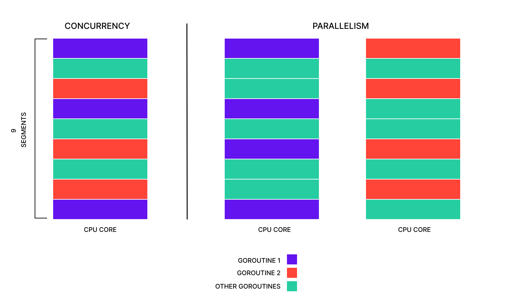

# Goroutine and channels in GO

- [Source - Digital Ocean](https://www.digitalocean.com/community/tutorials/how-to-run-multiple-functions-concurrently-in-go)
- [Source - Deep usage of golang doc](https://go.dev/doc/effective_go#concurrency)
- [Source - Parallelism is not concurrency](https://go.dev/blog/waza-talk)
- [Source - Goroutines in golang](https://golangdocs.com/goroutines-in-golang)
- [Source - Channels in golang](https://golangdocs.com/channels-in-golang)
- [Source - Channels in golang](https://go101.org/article/channel.html)

TODO:

- [ ] What is concurrency?
- [ ] What is multi-processing?

## What is Concurrency?

## Goroutine

A goroutine is a special type of function that can run while other goroutines are also running.
When a program is designed to run multiple streams of code at once, the program is designed to run concurrently.

### Running in Foreground

Typically, when a function is called, it will finish running completely before the code after it continues to run.
This is known as running in the `foreground` because it prevents your program from doing anything else before it finishes.

With a goroutine, the function call will continue running the next code right away while the goroutine runs in the `background`. Code is considered running in the background when it doesn't prevent other code from running before it finishes.

### Parallelism

The power goroutines provide is that each goroutine can run on a processor core at the same time. If your computer has four processor cores and your program has four goroutines, all four goroutines can run simultaneously. When multiple streams of code are running at the same time on different cores like this, it’s called running in parallel.



> [!NOTE]
> The left column in the diagram, labeled “Concurrency”, shows how a program designed around concurrency could run on a single CPU core by running part of goroutine1, then another function, goroutine, or program, then goroutine2, then goroutine1 again, and so on. To a user, this would seem like the program is running all the functions or goroutines at the same time, even though they’re actually being run in small parts one after the other.
> The column on the right of the diagram, labeled “Parallelism”, shows how that same program could run in parallel on a processor with two CPU cores. The first CPU core shows goroutine1 running interspersed with other functions, goroutines, or programs, while the second CPU core shows goroutine2 running with other functions or goroutines on that core. Sometimes both goroutine1 and goroutine2 are running at the same time as each other, just on different CPU cores.
> This diagram also shows another of Go’s powerful traits, scalability. A program is scalable when it can run on anything from a small computer with a few processor cores to a large server with dozens of cores, and take advantage of those additional resources. The diagram shows that by using goroutines, your concurrent program is capable of running on a single CPU core, but as more CPU cores are added, more goroutines can be run in parallel to speed up the program.

#### How to implement a concurrent program in Go?

##### 1.1 Make a program

```go
package main

import (
    "fmt"
)

func generateNumbers(){
    for idx := 1; idx <=3; idx++ {
        fmt.Printf("Generate number %v \n", idx)
    }
}

func printNumbers(){
    for idx := 1; idx <= 3; idx++ {
        fmt.Printf("Printing number %v \n", idx)
    }
}

func main(){
    printNumbers()
    generateNumbers()
}
```

And if we run the program using:

```sh
go run .
```

The output will be like this:

```sh
Printing number 1
Printing number 2
Printing number 3
Generating number 1
Generating number 2
Generating number 3
```

Imagine that each of this functions take 3 seconds for execution, so this program will take 6 seconds for running.
But these functions work independently from each other so, we can run them concurrently.

For running these functions concurrently, we have to tell Go to stop the `main()` function until these functions done.
if you don't wait for your goroutines to finish and your main function completes, the goroutines could potentially never run, or only part of them could run and not complete running.

For make those functions to run as a goroutine, just need to add a `go` keyword before calling them.

> [!IMPORTANT]
> To wait for the functions to finish, you'll use a `WaitGroup` from Go's `sync` package. The `sync` package contains `synchronization primitives`, such as WaitGroup, **that are designed to synchronize various parts of a program**.
> In your case, the synchronization keeps track of when both functions have finished running so you can exit the program.
> The `WaitGroup` primitive **works by counting how many things it needs to wait for**, using the `Add`, `Done`, and `Wait` functions.
> The Add function increases the count by the number provided to the function, and `Done` **decreases** the count by one. 
> The `Wait` function can then be used to wait until the count reaches **zero**, meaning that Done has been called enough times to offset the calls to Add. Once the count reaches zero, the Wait function will return and the program will continue running.

```go
package main

import (
    "fmt"
    "sync"
)

func generateNumbers(wg *sync.WaitGroup){
    defer wg.Done()

    for idx := 1; idx <= 3; idx++ {
        fmt.Printf("Generate number %v \n", idx)
    }
}

func printNumbers(wg *sync.WaitGroup){
    defer wg.Done()
    for idx := 1; idx <= 3; idx++ {
        fmt.Printf("Printing number %v \n", idx)
    } 
}

func main(){
    var wg sync.WaitGroup

    wg.Add(2)
    go printNumbers(&wg)
    go generateNumbers(&wg)

    wg.Wait()
    fmt.Println("Done")
}
```

And If we run the program, it will takes 3 seconds only `consider that we imagine each functions take 3 seconds from us for execution`.

```sh
go run .
```

**Output**:

```sh
Printing number 1
Generating number 1
Generating number 2
Generating number 3
Printing number 2
Printing number 3
Done
```

> [!CAUTION]
> In Go, `goroutines` aren't able to return values like a standard function would. You can still use the `go` keyword to call a function that returns values, but those return values will be thrown out and you won't be able to access them.
> **So, what do you do when you need data from one goroutine in another goroutine if you can't return values?**
> The solution is to use a Go feature called `channels`, which allow you to send data from one goroutine to another.

> [!WARNING]
> **Data race:**
> One of the more difficult parts of concurrent programming is **communicating safely between different parts of the program that are running simultaneously**. If you're not careful, you might run into problems that are only possible with concurrent programs. For example, a [data race](https://en.wikipedia.org/wiki/Race_condition) can happen when two parts of a program are running `concurrently`, and one part tries to `update a variable` while the other part is trying to r`ead it at the same time`. When this happens, the reading or writing can happen out of order, leading to one or both parts of the program using the wrong value. The name `data race` comes from both parts of the program **racing** each other to access the data

### Communicating Safely Between Goroutines with Channels

#### 2.0 Golang channels

In addition to goroutines, `channels` are another feature that makes concurrency **safer and easier to use**. A channel can be thought of like a pipe between two or more different goroutines that data can be sent through. One goroutine puts data into one end of the pipe and another goroutine gets that same data out. The difficult part of making sure the data gets from one to the other safely is handled for you.

#### 2.1 How to create a channel in Golang

Channels are created using the `make()` function and with type `chan` followed by their actual type, that could be one type from golang [`types of data`](https://www.digitalocean.com/community/tutorials/understanding-data-types-in-go).

```go
numbersChan := make(chan int)
```

Once declaring channel is done, either `read` or `write` into channel is possible by using the arrow-looking operator `<-`.
The position of this `<-` operator is important because it shows that you're reading or writing data from/to channel.

#### 2.2 Write data into channel

```go
number := 10
numbersChan <- number
```

#### 2.3 Read data from channel

```go
number := <- numbersChan
fmt.Printf("Read data from channel: %v", number)
```

#### 2.4 Iteration on a channel

> [!NOTE]
> Just like a `slice`, you can use the `range` keyword for iteration over the channel, using the `for loop`. 
> When a channel is **read** using the `range` keyword, **each iteration of the loop will read the next value from the channel and put it into the loop variable**.
> It will then continue reading from the channel until the channel is **closed** or the for loop is exited in other ways, such as a `break`

```go
numbersChan := make(chan int)
for num := range numbersChan {
    // Used the value received from channel
    if num <= 10 {
        // Stop iteration by "break" keyword
        break
    }
}
```

> [!IMPORTANT]
> In some cases, you may want **only to allow a function to read from or write to a channel**, `but not both`. To do this, you would add the `<-` operator onto the chan type `declaration`. Similar to reading and writing from a channel, the channel type uses the `<-` arrow to allow variables to constrain a channel to only reading, only writing, or both reading and writing.

#### 2.5 Making a function to only access read from a channel

```go
func readOnly(ch <-chan int){
    // ch is read-only
}
```

#### 2.6 Making a function to only access writing data to a channel

```go
func writeOnly(ch chan<- int){
    // ch is write-only
}
```

> [!TIP]
> Notice that `the arrow is pointing out of the channel for reading`, and `pointing into the channel for writing`.
> If the declaration doesn't have an arrow, as in the case of `chan int`, the **channel can be used for both reading and writing**.

> [!WARNING]
> Finally, once a channel is no longer being used, it's important to be closed using `close()` built-in function.
> This step is essential due to it's prevent [memory leak](https://en.wikipedia.org/wiki/Memory_leak)
> When a channel is created with `make()`, some of the computer's memory is used up for the channel, then when `close()` is called on the channel, that memory is given back to the computer to be used for something else.

### Now update the example

Now, update the `main.go` file in your program to use a `chan int` channel to communicate between your goroutines. The `generateNumbers` function will generate numbers and write them to the channel while the `printNumbers` function will read those numbers from the channel and print them to the screen. In the `main` function, you'll create a new channel to pass as a parameter to each of the other functions, then use `close()` on the channel to close it because it will no longer be used.

> [!IMPORTANT]
> The `generateNumbers` function is no longer need to be a goroutine because once that function is done running, the program will have finished generating all the numbers it needed to.
> This way, the `close()` function is only called on the channel before both functions have finished running.

```go
package main

import (
    "fmt"
    "sync"
)

func generateNumbers(ch <- chan int, wg *sync.WaitGroup){
    defer wg.Done()
    for idx := 1; idx <= 3; idx++ {
        fmt.Printf("Generate number %v \n", idx)
        ch <- idx
    }
}

func printNumbers(ch chan <- int, wg *sync.WaitGroup){
    defer wg.Done()

    for  num := range ch {
        fmt.Printf("Printing number %v \n", num)
    }
}

func main(){
    var wg sync.WaitGroup

    numbersChan := make(chan int)

    wg.Add(2)
    go printNumbers(numbersChan, &wg)

    generateNumbers(numbersChan, &wg)

    close(numbersChan)
    wg.Wait()
}
```

> [!CAUTION]
> Both functions above, either has read-only or write-only access to the channel, but they could access both read and write into channel, by declare them like `ch chan int`.
> But, giving both read and write access to each function, could lead your program into [`dead lock`](https://en.wikipedia.org/wiki/Deadlock)
> A deadlock can happen when one part of a program is waiting for another part of the program to do something, but that other part of the program is also waiting for the first part of the program to finish. Since both parts of the program are waiting on each other, the program will never continue running.
> The deadlock can happen due to the way channel communication works in Go. When part of a program is writing to a channel, it will wait until another part of the program reads from that channel before continuing on. Similarly, if a program is reading from a channel it will wait until another part of the program writes to that channel before it continues. A part of a program waiting on something else to happen is said to be blocking because it’s blocked from continuing until something else happens. Channels block when they are being written to or read from. So if you have a function where you’re expecting to write to a channel but accidentally read from the channel instead, your program may enter a deadlock because the channel will never be written to. Ensuring this never happens is one reason to use a `chan <- int` or a `<- chan int` instead of just a `chan int`.

> [!WARNING]
> One other important aspect of the updated code is using `close()` to close the channel once it's done being written to by `generateNumbers`. In this program, `close()` causes the `for ... range` loop in `printNumbers` to exit. Since using `range` to read from a channel continues until the channel it's reading from is closed, if close isn't called on `numberChan` then `printNumbers` will **never finish**. If `printNumbers` never finishes, the **WaitGroup's Done method will never be called** by the defer when `printNumbers` exits. If the Done method is never called from `printNumbers`, the program itself will never exit because the WaitGroup's Wait method in the main function will never continue.
> This is another example of a deadlock because the main function is waiting on something that will never happen.

### Deep in channels

> [!IMPORTANT]
> **Receivers always block until there is a data to be received**.
> If the channel is **unbuffered**, the **sender blocks until the receiver has received the value.**
> If the channel has a buffer, the sender blocks only until the value has been copied to the buffer; if the buffer is full, this means waiting until some receiver has retrieved a value.

---

A buffered channel can be used like a semaphore, for instance to limit throughput. In this example, incoming requests are passed to handle, which sends a value into the channel, processes the request, and then receives a value from the channel to ready the `semaphore` for the next consumer.
**The capacity of the channel buffer limits the number of simultaneous calls to process.**

```go
var sem = make(chan int, MaxOutstanding)

func handle(r *Request) {
    sem <- 1    // Wait for active queue to drain.
    process(r)  // May take a long time.
    <-sem       // Done; enable next request to run.
}

func Serve(queue chan *Request) {
    for {
        req := <-queue
        go handle(req)  // Don't wait for handle to finish.
    }
}
```

Once `MaxOutstanding` handlers are executing process, any more will block trying to send into the filled channel buffer, until one of the existing handlers finishes and receives from the buffer.

> [!CAUTION]
> This design has a problem, though: `Serve` creates a new goroutine for every incoming request, even though only `MaxOutstanding` of them can run at any moment. As a result, the program can consume unlimited resources if the requests come in too fast. We can address that deficiency by changing Serve to gate the creation of the goroutines:

```go
func Serve(queue chan *Request) {
    for req := range queue {
        sem <- 1
        go func() {
            process(req)
            <-sem
        }()
    }
}
```

### Worker pools

#### Sources

| Title | Link |
| --- | --- |
| GoByExample | [Link](https://gobyexample.com/worker-pools) |
| GeeksForGeek | [Link](https://www.geeksforgeeks.org/go-worker-pools/) |

> [!CAUTION]
> The `worker pools` topic is a basic topic that it is solved by `WaitGroups` in golang, but this note is for whenever we doesn't have any wait group!

A `worker pool` limits the number of concurrent tasks by using a fixed number of workers to process jobs from a queue.
This prevents excessive Goroutines, reduces memory and CPU usage, and ensures efficient resource management.

```go
package main

import (
    "fmt"
    "time"
)

func worker(id int, jobs <-chan int, results chan<- int) {
    for j := range jobs {
        fmt.Printf("Worker %v Started job %v \n", id, j)
        time.Sleep(time.Second)
        fmt.Printf("Worker %v Finished job %v \n", id, j)
        results <- j
    }
}

func main() {
    maxJobSize := 5

    jobs := make(chan int, maxJobSize)
    results := make(chan int, maxJobSize)

    for i := 1; i <= 3; i++ {
        go worker(i, jobs, results)
    }

    for i := 1; i <= maxJobSize; i++ {
        jobs <- i
    }

    close(jobs)

    for i := 1; i <= maxJobSize; i++ {
        <-results
    }
}
```

**Explain:**

The code above, create 3 workers at first, but workers are waiting for `jobs` channel because at initial `jobs` is empty. Then It fill the jobs channel until it reaches the capacity and then close the channel to make it clear for `worker` that the jobs are done. The `worker` now starts it's job and read data from `jobs` channel, and at the end put the result in `results` channel. After the `worker` responsibility get finish, the `main` function read data from `results` and then reach the end of code.
